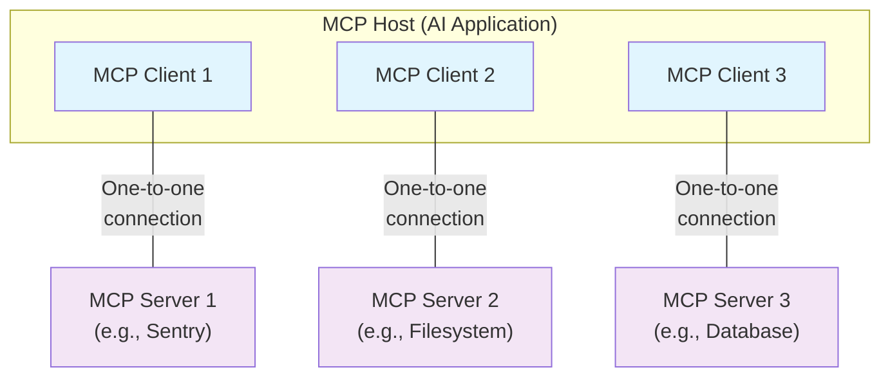

# MCP Architecture: MVP Examples

## 🎯 Core Concept
MCP enables AI applications to securely access external context and perform actions through standardized tool-based interactions.

<Note>
  MCP focuses solely on the protocol for context exchange—it does not dictate
  how AI applications use LLMs or manage the provided context.
</Note>

## 📋 What MCP Includes

The Model Context Protocol includes the following projects:

* **[MCP Specification](https://modelcontextprotocol.io/specification/latest)**: A specification of MCP that outlines the implementation requirements for clients and servers.
* **[MCP SDKs](/docs/sdk)**: SDKs for different programming languages that implement MCP.
* **MCP Development Tools**: Tools for developing MCP servers and clients, including the [MCP Inspector](https://github.com/modelcontextprotocol/inspector)
* **[MCP Reference Server Implementations](https://github.com/modelcontextprotocol/servers)**: Reference implementations of MCP servers.

## 🏗️ Architecture Overview

### Participants
- **MCP Host**: AI application (Claude Desktop, VS Code) - can have multiple clients
- **MCP Client**: Connection manager (1:1 with each server) - handles communication with one server
- **MCP Server**: Context provider (local/remote) - serves tools, resources, and prompts

### Relationships
- **Host ↔ Clients**: One host can manage multiple clients (1:many)
- **Client ↔ Server**: Each client connects to exactly one server (1:1)
- **Host ↔ Servers**: Host can access multiple servers through multiple clients (1:many)

**For example**: Visual Studio Code acts as an MCP host. When Visual Studio Code establishes a connection to an MCP server, such as the [Sentry MCP server](https://docs.sentry.io/product/sentry-mcp/), the Visual Studio Code runtime instantiates an MCP client object that maintains the connection to the Sentry MCP server.
When Visual Studio Code subsequently connects to another MCP server, such as the [local filesystem server](https://github.com/modelcontextprotocol/servers/tree/main/src/filesystem), the Visual Studio Code runtime instantiates an additional MCP client object to maintain this connection, hence maintaining a one-to-one relationship of MCP clients to MCP servers.



Note that **MCP server** refers to the program that serves context data, regardless of where it runs. MCP servers can execute locally or remotely. For example, when Claude Desktop launches the [filesystem server](https://github.com/modelcontextprotocol/servers/tree/main/src/filesystem), the server runs locally on the same machine because it uses the STDIO transport. This is commonly referred to as a "local" MCP server. The official [Sentry MCP server](https://docs.sentry.io/product/sentry-mcp/) runs on the Sentry platform, and uses the Streamable HTTP transport. This is commonly referred to as a "remote" MCP server.

### Two-Layer Design
- **Data Layer**: JSON-RPC 2.0 protocol with primitives - [stateful protocol](https://modelcontextprotocol.io/specification/latest) that requires lifecycle management
- **Transport Layer**: 
  - **Stdio**: Local process communication (simple, secure for single-client)
  - **HTTP**: Remote network communication (scalable, multi-client, requires auth) - MCP recommends using OAuth to obtain authentication tokens

## 🔧 Core Primitives

MCP primitives are the most important concept within MCP. They define what clients and servers can offer each other. These primitives specify the types of contextual information that can be shared with AI applications and the range of actions that can be performed.

### Server → Client
- **Tools**: Executable functions that AI applications can invoke to perform actions (e.g., file operations, API calls, database queries)
- **Resources**: Data sources that provide contextual information to AI applications (e.g., file contents, database records, API responses)
- **Prompts**: Reusable templates that help structure interactions with language models (e.g., system prompts, few-shot examples)

Each primitive type has associated methods for discovery (`*/list`), retrieval (`*/get`), and in some cases, execution (`tools/call`).

### Client → Server
### Client → Server
- **Sampling**: Request LLM completions
- **Elicitation**: Request user input
- **Logging**: Send debug messages

## 📡 Additional Features

### Notifications
The protocol supports real-time notifications to enable dynamic updates between servers and clients. For example, when a server's available tools change, the server can send tool update notifications to inform connected clients about these changes.

### Progress Tracking
MCP supports progress tracking for long-running operations, enabling clients to display progress indicators and handle cancellation requests.

### Capability Negotiation
MCP uses capability negotiation during initialization to determine what features both client and server support. This enables efficient communication by avoiding unsupported operations.

For detailed information about lifecycle management see the [specification](/specification/2025-06-18/basic/lifecycle).

For more details about server primitives see [server concepts](./server-concepts). For more details about client primitives see [client concepts](./client-concepts).

## 📋 MVP Examples

### 1. Simple Calculator Tool Server

```python
#!/usr/bin/env python3
import asyncio
from mcp import Server, Tool
from mcp.server.stdio import stdio_server

server = Server("Calculator")

@server.list_tools()
async def list_tools():
    return [
        Tool(
            name="add",
            description="Add two numbers",
            inputSchema={
                "type": "object",
                "properties": {
                    "a": {"type": "number"},
                    "b": {"type": "number"}
                },
                "required": ["a", "b"]
            }
        ),
        Tool(
            name="multiply",
            description="Multiply two numbers",
            inputSchema={
                "type": "object",
                "properties": {
                    "a": {"type": "number"},
                    "b": {"type": "number"}
                },
                "required": ["a", "b"]
            }
        )
    ]

@server.call_tool()
async def call_tool(name, arguments):
    if name == "add":
        result = arguments["a"] + arguments["b"]
        return [{"type": "text", "text": str(result)}]
    elif name == "multiply":
        result = arguments["a"] * arguments["b"]
        return [{"type": "text", "text": str(result)}]
    else:
        raise ValueError(f"Unknown tool: {name}")

async def main():
    async with stdio_server() as (read_stream, write_stream):
        await server.run(read_stream, write_stream)

if __name__ == "__main__":
    asyncio.run(main())
```

**MCP Configuration:**
```json
{
  "mcpServers": {
    "calculator": {
      "command": "python",
      "args": ["/path/to/calculator.py"]
    }
  }
}
```

### 2. File Reader Resource Server

```python
#!/usr/bin/env python3
import asyncio
from mcp import Server, Resource
from mcp.server.stdio import stdio_server
from pathlib import Path

server = Server("FileReader")

@server.list_resources()
async def list_resources():
    return [
        Resource(
            uri="file://README.md",
            name="README File",
            description="Project README file",
            mimeType="text/markdown"
        )
    ]

@server.read_resource()
async def read_resource(uri):
    if uri.startswith("file://"):
        filepath = uri[7:]  # Remove "file://" prefix
        path = Path(filepath)
        if path.exists() and path.is_file():
            return path.read_text()
        else:
            return f"File not found: {filepath}"
    else:
        raise ValueError(f"Unsupported URI scheme: {uri}")

async def main():
    async with stdio_server() as (read_stream, write_stream):
        await server.run(read_stream, write_stream)

if __name__ == "__main__":
    asyncio.run(main())
```

### 3. Weather API Tool Server

```python
#!/usr/bin/env python3
import asyncio
from mcp import Server, Tool
from mcp.server.stdio import stdio_server

server = Server("Weather")

@server.list_tools()
async def list_tools():
    return [
        Tool(
            name="get_weather",
            description="Get current weather for a city",
            inputSchema={
                "type": "object",
                "properties": {
                    "city": {"type": "string"}
                },
                "required": ["city"]
            }
        )
    ]

@server.call_tool()
async def call_tool(name, arguments):
    if name == "get_weather":
        city = arguments["city"]
        # Mock weather data (replace with real API)
        weather_data = {
            "New York": "72°F, Sunny",
            "London": "15°C, Cloudy",
            "Tokyo": "25°C, Rainy"
        }
        result = weather_data.get(city, f"Weather data not available for {city}")
        return [{"type": "text", "text": result}]
    else:
        raise ValueError(f"Unknown tool: {name}")

async def main():
    async with stdio_server() as (read_stream, write_stream):
        await server.run(read_stream, write_stream)

if __name__ == "__main__":
    asyncio.run(main())
```

### 4. Database Query Tool Server

```python
#!/usr/bin/env python3
import asyncio
import sqlite3
from mcp import Server, Tool
from mcp.server.stdio import stdio_server
from typing import List, Dict, Any

server = Server("Database")

def get_db_connection():
    return sqlite3.connect(":memory:")

@server.list_tools()
async def list_tools():
    return [
        Tool(
            name="query_database",
            description="Execute SQL query and return results",
            inputSchema={
                "type": "object",
                "properties": {
                    "sql": {"type": "string"}
                },
                "required": ["sql"]
            }
        )
    ]

@server.call_tool()
async def call_tool(name, arguments):
    if name == "query_database":
        sql = arguments["sql"]
        conn = get_db_connection()
        cursor = conn.cursor()

        try:
            cursor.execute(sql)
            columns = [desc[0] for desc in cursor.description or []]
            results = [dict(zip(columns, row)) for row in cursor.fetchall()]
            return [{"type": "text", "text": str(results)}]
        except Exception as e:
            return [{"type": "text", "text": str({"error": str(e)})}]
        finally:
            conn.close()
    else:
        raise ValueError(f"Unknown tool: {name}")

async def main():
    async with stdio_server() as (read_stream, write_stream):
        await server.run(read_stream, write_stream)

if __name__ == "__main__":
    asyncio.run(main())
```

### 5. HTTP Calculator Server

```python
#!/usr/bin/env python3
import asyncio
from mcp import Server, Tool
from mcp.server.http import http_server
import uvicorn

server = Server("HTTP-Calculator")

@server.list_tools()
async def list_tools():
    return [
        Tool(
            name="add",
            description="Add two numbers",
            inputSchema={
                "type": "object",
                "properties": {
                    "a": {"type": "number"},
                    "b": {"type": "number"}
                },
                "required": ["a", "b"]
            }
        ),
        Tool(
            name="multiply",
            description="Multiply two numbers",
            inputSchema={
                "type": "object",
                "properties": {
                    "a": {"type": "number"},
                    "b": {"type": "number"}
                },
                "required": ["a", "b"]
            }
        )
    ]

@server.call_tool()
async def call_tool(name, arguments):
    if name == "add":
        result = arguments["a"] + arguments["b"]
        return [{"type": "text", "text": str(result)}]
    elif name == "multiply":
        result = arguments["a"] * arguments["b"]
        return [{"type": "text", "text": str(result)}]
    else:
        raise ValueError(f"Unknown tool: {name}")

async def main():
    # Create HTTP server
    app = http_server(server)
    
    # Run with uvicorn
    config = uvicorn.Config(app, host="0.0.0.0", port=8000)
    server_instance = uvicorn.Server(config)
    await server_instance.serve()

if __name__ == "__main__":
    asyncio.run(main())
```

**HTTP MCP Configuration:**
```json
{
  "mcpServers": {
    "http-calculator": {
      "command": "python",
      "args": ["/path/to/http_calculator.py"],
      "env": {
        "MCP_SERVER_URL": "http://localhost:8000"
      }
    }
  }
}
```

### 6. HTTP Resource Server with Authentication

```python
#!/usr/bin/env python3
import asyncio
from mcp import Server, Resource, Tool
from mcp.server.http import http_server
import uvicorn
from pathlib import Path

server = Server("HTTP-FileServer")

# Simple authentication (in production, use proper auth)
API_KEY = "your-secret-key"

@server.list_resources()
async def list_resources():
    return [
        Resource(
            uri="file://secure-data.txt",
            name="Secure Data File",
            description="Protected data file",
            mimeType="text/plain"
        ),
        Resource(
            uri="file://public-info.md",
            name="Public Information",
            description="Publicly accessible information",
            mimeType="text/markdown"
        )
    ]

@server.read_resource()
async def read_resource(uri):
    if uri.startswith("file://"):
        filepath = uri[7:]  # Remove "file://" prefix
        path = Path(filepath)
        
        # Check if file requires authentication
        if "secure" in filepath and not _check_auth():
            return "Access denied: Authentication required"
        
        if path.exists() and path.is_file():
            return path.read_text()
        else:
            return f"File not found: {filepath}"
    else:
        raise ValueError(f"Unsupported URI scheme: {uri}")

@server.list_tools()
async def list_tools():
    return [
        Tool(
            name="authenticate",
            description="Authenticate with API key",
            inputSchema={
                "type": "object",
                "properties": {
                    "api_key": {"type": "string"}
                },
                "required": ["api_key"]
            }
        )
    ]

@server.call_tool()
async def call_tool(name, arguments):
    if name == "authenticate":
        if arguments["api_key"] == API_KEY:
            # In a real implementation, you'd set a session/token
            return [{"type": "text", "text": "Authentication successful"}]
        else:
            return [{"type": "text", "text": "Authentication failed"}]
    else:
        raise ValueError(f"Unknown tool: {name}")

def _check_auth():
    # In a real implementation, check session/token from request context
    return True  # Simplified for example

async def main():
    app = http_server(server)
    config = uvicorn.Config(app, host="0.0.0.0", port=8001)
    server_instance = uvicorn.Server(config)
    await server_instance.serve()

if __name__ == "__main__":
    asyncio.run(main())
```

## 🔄 Transport Comparison: Stdio vs HTTP

### Stdio Transport (Local)
**Best For**: Desktop applications, single-client scenarios, development
- **Pros**: Simple setup, no network config, automatic lifecycle management
- **Cons**: Local only, single client connection, process-dependent
- **Examples**: Claude Desktop, VS Code extensions, local AI assistants

### HTTP Transport (Remote)
**Best For**: Multi-client servers, production deployments, web services
- **Pros**: Remote access, multiple concurrent clients, authentication support
- **Cons**: Requires network setup, authentication management, server maintenance
- **Examples**: Cloud services, enterprise integrations, multi-user applications

### Choosing Transport:
- **Use Stdio** for: Local development, desktop apps, single-user tools
- **Use HTTP** for: Production servers, multi-client access, remote deployments

## 🚀 Quick Start
```

### 1. Install Dependencies
```bash
pip install mcp uvicorn
# For HTTP servers, also install:
# pip install fastapi  # Usually included with mcp
```

### 2. Create Server
```python
import asyncio
from mcp import Server, Tool
from mcp.server.stdio import stdio_server

server = Server("MyServer")

@server.list_tools()
async def list_tools():
    return [
        Tool(
            name="hello",
            description="Say hello to someone",
            inputSchema={
                "type": "object",
                "properties": {"name": {"type": "string"}},
                "required": ["name"]
            }
        )
    ]

@server.call_tool()
async def call_tool(name, arguments):
    if name == "hello":
        result = f"Hello, {arguments['name']}!"
        return [{"type": "text", "text": result}]
    else:
        raise ValueError(f"Unknown tool: {name}")

async def main():
    async with stdio_server() as (read_stream, write_stream):
        await server.run(read_stream, write_stream)

if __name__ == "__main__":
    asyncio.run(main())
```

### 3. Configure MCP Client
```json
{
  "mcpServers": {
    "my-server": {
      "command": "python",
      "args": ["server.py"]
    }
  }
}
```

## 📡 Communication Flow

### Initialization
```json
// Client → Server
{
  "jsonrpc": "2.0",
  "id": 1,
  "method": "initialize",
  "params": {
    "protocolVersion": "2025-06-18",
    "capabilities": {},
    "clientInfo": {"name": "client", "version": "1.0.0"}
  }
}

// Server → Client
{
  "jsonrpc": "2.0",
  "id": 1,
  "result": {
    "protocolVersion": "2025-06-18",
    "capabilities": {"tools": {}},
    "serverInfo": {"name": "server", "version": "1.0.0"}
  }
}
```

### Tool Discovery
```json
// Client → Server
{
  "jsonrpc": "2.0",
  "id": 2,
  "method": "tools/list"
}

// Server → Client
{
  "jsonrpc": "2.0",
  "id": 2,
  "result": {
    "tools": [
      {
        "name": "hello",
        "description": "Say hello to someone",
        "inputSchema": {
          "type": "object",
          "properties": {"name": {"type": "string"}},
          "required": ["name"]
        }
      }
    ]
  }
}
```

### Tool Execution
```json
// Client → Server
{
  "jsonrpc": "2.0",
  "id": 3,
  "method": "tools/call",
  "params": {
    "name": "hello",
    "arguments": {"name": "World"}
  }
}

// Server → Client
{
  "jsonrpc": "2.0",
  "id": 3,
  "result": {
    "content": [{"type": "text", "text": "Hello, World!"}]
  }
}
```

### Notifications
```json
// Server → Client (no response expected)
{
  "jsonrpc": "2.0",
  "method": "notifications/tools/list_changed"
}
```

## 🎯 Key Takeaways

1. **Simple Protocol**: JSON-RPC 2.0 with clear request/response patterns
2. **Tool-First**: Focus on executable functions that AI can invoke
3. **Discovery-Driven**: Dynamic tool/resource enumeration
4. **Transport Agnostic**: Same protocol works locally (stdio) or remotely (HTTP)
5. **Capability Negotiation**: Clients and servers declare what they support
6. **Real-time Updates**: Notifications for dynamic changes
7. **Flexible Deployment**: Choose stdio for local/desktop, HTTP for remote/multi-client
8. **Stateful Protocol**: Requires lifecycle management but can be stateless with HTTP transport

## 🔗 Next Steps

- **[MCP Specification](https://modelcontextprotocol.io/specification/latest)**: Complete protocol specification with implementation requirements
- **[MCP SDK Documentation](https://modelcontextprotocol.io/docs)**: SDKs for different programming languages
- **[Reference Server Implementations](https://github.com/modelcontextprotocol/servers)**: Official MCP server examples
- **[MCP Inspector](https://github.com/modelcontextprotocol/inspector)**: Tool for developing and testing MCP servers
- **[Server Concepts](./server-concepts)**: Detailed guide to server primitives and implementation
- **[Client Concepts](./client-concepts)**: Detailed guide to client primitives and implementation
- **Build your own MCP server** for custom integrations

---

**MCP enables AI applications to safely and efficiently access external context and perform actions through standardized tool-based interactions.**